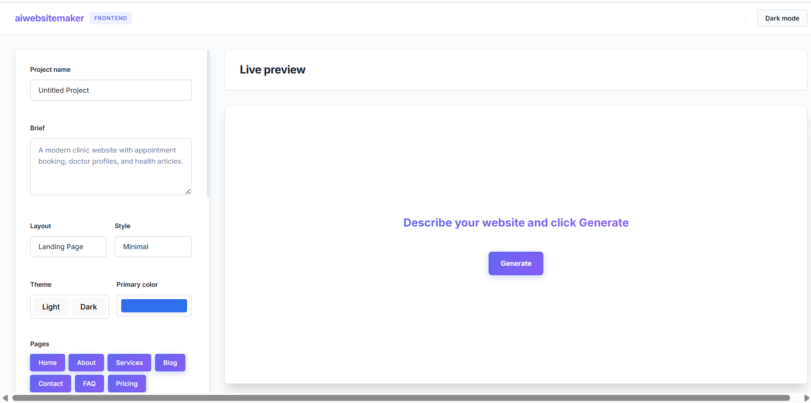
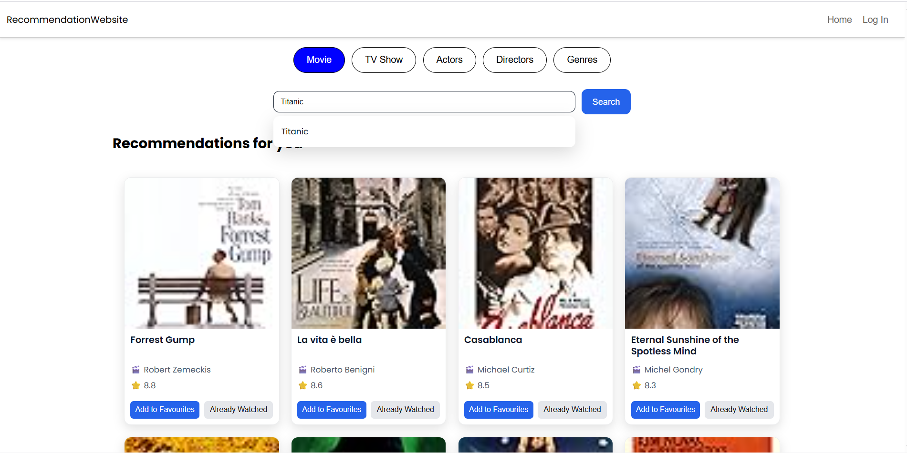

# 💫 About Me

I am a **MERN Stack** and **C++** developer with a strong interest in building real-world, user-focused applications.  
I am currently a **3rd-year B.Tech student** at **Deen Bandhu Chhotu Ram University of Technology, Murthal**.  
I enjoy learning new technologies and continuously improving my problem-solving and development skills.

---

## 🚀 My Projects

### 1️⃣ AKRIT
- Users (clients) can send booking requests to artists, and artists can manage these requests through their personalized dashboard.
- 🔗 **Live Link:** https://akrit.vercel.app/

---

### 2️⃣ AI Website Generator
- A web application that uses the **OpenRouter API** to generate complete HTML frontend code based on user input and website descriptions.
- 🔗 **Live Link:** https://ai-website-generator-liard.vercel.app/

---

### 3️⃣ Project Management App
- A project management platform that helps users track pending projects and record progress.
- Features **drag-and-drop functionality** implemented using **React Pangea**.
- 🔗 **Live Link:** https://project-management-sigma-rosy.vercel.app/

---

### 4️⃣ Movie Recommendation System
- A recommendation system that takes the user’s favorite movie and suggests similar movies using **Pandas** and **NumPy**.
- This version uses basic data-driven logic and will be improved further with machine learning.
- 🔗 **Live Link:** https://movie-recommendation-pi-ten.vercel.app/

---

### 5️⃣ My Portfolio Website
- A personal portfolio showcasing my projects, achievements, skills, and background.
- 🔗 **Live Link:** https://final-portfolio-six-gamma.vercel.app/

---

## 🌐 Socials:
  

# 💻 Tech Stack:
                     
# 📊 GitHub Stats:
 
 

### 🔝 Top Contributed Repo

---

<!-- Proudly created with GPRM ( https://gprm.itsvg.in ) -->
